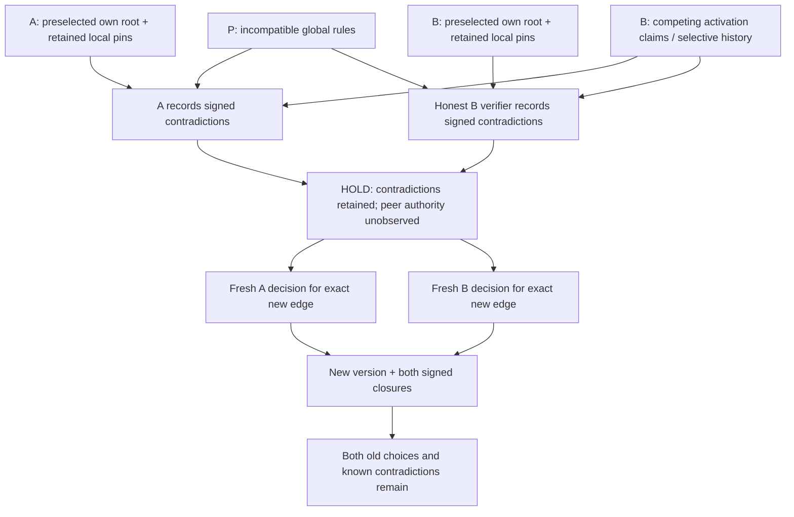

# SOVEREIGN-BOOTSTRAP-EXTERNAL-001

**External campaign: NOT_EXECUTED / BLOCKED_EXTERNAL_INPUTS.** The workspace contains local cryptographic root specimens, but no supplied pre-existing roots with independently administered control and independently retained pin evidence. The local adversarial campaign and offline operator adapter are ready; they do not close the external-administration gap [S01–S03, S26–S27, S33].

All claims are classified in the [claim matrix](SOVEREIGN-BOOTSTRAP-EXTERNAL-001-CLAIM-MATRIX.md), with a [machine-readable counterpart](../fixtures/sovereign-bootstrap-external-001/claim-matrix.json). External missing inputs are tracked in [external-inputs.json](../fixtures/sovereign-bootstrap-external-001/external-inputs.json) [S01, S33].

## Hostile target

A and B must already exist before the real experiment starts, under different administration. Each operator retains its own public root/genesis/history pin and local observation-head selection independently of P, transport and the other operator. P issues incompatible global policy rules. B also signs competing activation claims or serves a selectively incomplete history [S04–S09, S26–S29].

The local specimen gives B its genuine signing key. B signs two role-correct proposals and two incompatible `ADMIT` accounts for the same policy slot/version/base history. P signatures and B signatures remain valid. Each honest verifier can discover attributable contradiction under its own selected root without importing foreign sovereignty. An actively malicious B operator can ignore its verifier; symmetry means reproducibility under B’s selected root, not compelled human agreement [S04–S06, S24, S32].



The diagram describes the protocol and the locally tested claim path. The actual externally administered A/B nodes are **not** supplied by the local fixture generator [S01–S02, S04–S08, S14–S16, S32–S33].

## Discovering claims without admitting sovereignty

The observer already attributes P through its own root-signed, bounded delegation. It can compare P’s incompatible rules without trusting B. It also verifies B’s curve-point signatures and compares claimed activation slots, versions, base heads and proposal bindings. That earns **E2 SIGNED contradiction**, not truth, authority, human identity or evidence that B actually enacted either activation [S04–S06, S21, S24].

An observer that has seen only one B branch cannot know the other exists. It remains on HOLD without inventing a contradiction. Later exchange can reveal the fork. Global completeness stays UNOBSERVED [S08–S09, S31].

## Knowledge must survive hostile reconstruction

The prior stateless assessor fails closed on truncated proof, but its `conflict` facet can become UNOBSERVED even though a prior local history records the dispute’s IDs. The actual before/after results are preserved in [prior-stateless-loss.json](../fixtures/sovereign-bootstrap-external-001/prior-stateless-loss.json). This was a reporting/knowledge limitation, not an admission bypass [S12].

A separate root-signed local observation log now commits the archive IDs and reconstructed conflict IDs. Each entry causally binds the preceding observation and the unchanged original history head. Every snapshot must retain preceding IDs, and replay reproduces its conflict IDs from verified records. The caller pins the observation head independently. A broker-supplied cleaner archive cannot replace this owner-retained view [S07, S10, S13, S18].

A lost counterevidence payload produces HOLD. The correctly pinned signed log retains **remembered conflict IDs**, while `conflict_evidence_level` falls to **E0 UNOBSERVED** when the signature pair cannot be reproduced. Remembering an attributable local statement is not fabricating missing counterevidence. Exact backups can restore reconstruction; all-data loss cannot [S10–S11, S29].

Incoming artifacts merge additively into local knowledge. They never overwrite the local archive or local selection. A malformed incoming record fails closed while preserving already reconstructed local contradiction. Metadata aliases cannot hide cryptographic key sameness [S07, S13, S19–S21, S37].

## The fresh bilateral act

The new policy receipt advances beyond known earlier activation versions: the frozen specimen moves from P’s version 1 and B’s competing version 2 accounts to version 3. Its proposal binds both original policy IDs, history heads, local observation heads, public view digests, exact retained archive IDs and all known contradiction IDs [S14–S15, S39].

Each root signs its own new decision, selecting the exact peer key/genesis for **THIS_NEW_EDGE_ONLY** and explicitly acknowledging the contradiction set. Both root keys sign closure over the complete public core after both decisions. Old consent cannot be replayed against this proposal. Missing or refused fresh consent stays on HOLD; changing a signed decision breaks the original closure [S14–S19, S25].

The old policy receipts, local selections and competing B accounts remain present. `history_rewrite`, `sovereignty_import` and `conflict_erasure` must all remain false. A fresh agreement does not make B’s old claims A’s truth. “Old truth” here means old attributable local records and choices, not a proof of objective historical truth [S15, S24–S25, S39].

The strongest local edge result is **E3 CORROBORATED-KEYS** with retained E2 signed contradictions. Administrative separation, actual remote activation, absence of common orchestration and global finality remain UNOBSERVED [S01–S02, S24, S31, S40].

## External execution boundary

The operator adapter has no root initializer and no two-party coordinator. Each invocation reads one already existing local key and independently supplied own selection/view. The public transport can carry proposals, views, decisions and closures; it carries no private-key input. The local test driver controls both stores and is explicitly a simulation [S02–S03, S37].

A public packet does not establish that its pins were retained independently, its roots predate the experiment, or the operators lack common orchestration. Those claims need external control evidence reviewed independently of P and B’s assertions. A platform job, distinct directory, timestamp or self-signature cannot substitute for that evidence [S01–S02, S26–S27].

This adapter currently consumes existing reLATTE P-256 root/history records. Roots using another representation require a separately reviewable adapter that binds the existing root and its previously retained pin. Reconstituting replacement roots for the ceremony would leave the requested pre-existence claim unobserved [S03, S26–S27, S33].

No new workflow claims administrative separation. Existing CI runs the local tests, frozen replay and mutations. There are 30 new local tests, 128 seeded selective deliveries, cold replacement verification and seven new deliberate guard removals [S02, S20, S22–S23, S34–S35].

## Replay and next boundary

```sh
npm run verify
npm run sovereign:replay
node --experimental-strip-types scripts/sovereign-bootstrap-external-independent.mjs \
  fixtures/sovereign-bootstrap-external-001/selection-A.json \
  fixtures/sovereign-bootstrap-external-001/bundle.json
```

See the [operator ceremony](SOVEREIGN-BOOTSTRAP-EXTERNAL-001-OPERATOR.md) for public-only exchange and local signing. The remaining required action is the actual external run: two named pre-existing administrations supply their original public root/control evidence, independently retained selections and independently generated signed decisions. B serves contradictory and selectively incomplete evidence. The result must be assessed separately from this local campaign [S01–S03, S26–S29, S33].
