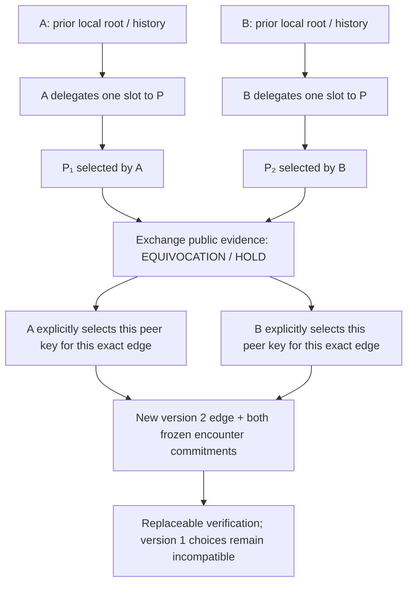

# TRUST-BOOTSTRAP-EQUIVOCATION-001

The local specimen achieves all five requested operations: discover P’s contradiction, retain both histories, refuse automatic convergence, record a fresh mutually witnessed policy edge, and preserve both past policy choices. The earned edge level is **E3 CORROBORATED-KEYS**. Separately administered roots remain **UNOBSERVED**; this same-host experiment uses separate local processes and scripted choices [B01, B03–B08, B12, B16, B26, B35].

This continues draft PR #67. It supplies a hostile bootstrap research specimen, not an administrative or human quorum claim [B34–B36]. Exact claims and limits are in the [claim matrix](TRUST-BOOTSTRAP-EQUIVOCATION-001-CLAIM-MATRIX.md).



The diagram represents signed causal bindings and local selections. It does not establish wall-clock creation time, separate administrators, truth or global policy uniqueness [B02–B07, B12, B20, B26, B29].

## What establishes the boundary

Each root constitution exists in its own local store before P’s key is generated. Its signed journal delegates P only one named policy slot/version. A selects P₁; B selects P₂. Both claims purport to supply **one rule for both admins**, at the same slot and version. Each claim references only its own receiving root’s prior delegation: neither initial policy record contains a peer-root commitment. Their `handoff_rule` terms disagree. This makes them competing accounts under the declared scope, rather than two legitimate per-admin policies [B01–B04, B32].

P is already attributable under each local delegation. A can therefore verify P₂’s contradiction without accepting B’s root as authority. B’s self-signed journal can be checked for coherence, but supplies no external root selection. The caller supplies its own previously selected key, genesis and durable head; the verifier never selects a root from the proof [B02–B05, B10, B22–B23].

After discovery, each local journal appends `OBSERVE_CONFLICT` referencing **both** claim IDs. The future proposal binds both exact historical heads, both original selections and the full disputed claim set. Version 2 has two exact key participants, no foreign-root import and no history rewrite. Each participant signs a separate local `ADMIT` or `REFUSE` record, binding the proposal, its own old head and genesis, and the exact peer key/genesis. The proposer cannot consent for the peer, and P cannot make either local root decision [B06–B12, B36].

`ADMITTED_BY_SIGNED_LOCAL_DECISION` means that the preselected local root signed the scoped declaration. It does not prove an actual human choice or a remote sovereign’s execution. The participant harness separately commits local state and verifies it after restart [B16, B27]. The future policy record is an experiment artifact; this pass does not claim enforcement of arbitrary later handoffs under a production policy engine [B07, B12, B35–B36].

## The failure that forced a repair

The first unclosed design checked compatible local decisions but did not commit the encounter’s record set. If A also signed a contradictory refusal, the complete proof stayed on HOLD. Deleting that refusal left two attractive admissions and could raise the result. A disposable copy of the real assessor with only the scope guard removed reproduces that trust increase. The exact removed guard, source hashes, valid contradictory records and repaired before/after conclusions remain in [omission-failure.json](../fixtures/trust-bootstrap-equivocation-001/omission-failure.json) [B13–B14].

Both roots now sign a closure receipt over the canonical digest of the entire public core and the exact record inventory. These signatures occur after the local decisions, so there is no circular receipt-ID dependency. Unknown, changed or missing core records fail `FROZEN_ENCOUNTER_EVIDENCE_CHANGED`. Missing either closure stays on HOLD. Closure scope is explicitly `THIS_FROZEN_ENCOUNTER_ONLY`; it cannot establish global completeness [B14–B15, B30–B32, B37].

The omission specimen gives the attacker genuine signatures and genuine root keys. The hostile semantic tests re-sign and re-close their altered evidence so an incidental digest mismatch cannot stand in for the tested semantic guard. Tests separately attack evidence loss while retaining the original signed closures [B11, B13–B14, B32–B33].

## Durable reconstruction

The participant script generates each root key locally and transfers only checked public JSON. Every history event appends to an NDJSON log. Activation keeps a content-addressed encounter archive; the convenience snapshot cannot erase that archive. Before-history bytes must remain an exact prefix of each later log [B01, B06, B17, B28].

The harness deletes A/B/P private JWK files, restarts B from its public state and append log, then deletes all original participant directories. Fresh C/D native verifier processes reconstruct the same edge from the public proof and externally supplied historical root/head selections. A fresh verifier given the same proof **without** a local selection returns `NO_LOCAL_ROOT_SELECTION` [B05, B16–B18, B23–B25]. Deletion here is a local filesystem observation; physical erasure or absence of secret copies is UNOBSERVED [B15–B17].

The second verifier implements bootstrap semantics without importing the primary assessment function, `protocol.ts` or `canonical.ts`. It rebuilds IDs and verifies native P-256 signatures through the earlier independent receipt primitive. It shares strict JSON ingress, the specification, Node/JSON semantics and runtime/provider ancestry. This is implementation diversity, not full independence [B18–B19].

## Where trust stops

A self-signature cannot establish that a root was selected before a hostile bundle, belongs to the intended administrator, or stayed under honest control. Those are external root assumptions [B22–B24]. Administrative separation, humans, non-collusion, live consent and current liveness are unobserved [B15, B26–B27].

A retained `active_edge_id` refuses a different otherwise valid edge with `KNOWN_ACTIVE_POLICY_FORK`. A fresh historical verifier lacking that retained selection can reconstruct another valid mutually signed edge separately. There is no global single-policy or finality proof. Replacing trusted pins is a new external decision; it is not replay increasing the old evidence level [B23, B28–B30].

The next hardest experiment uses genuinely pre-existing roots under different administrators, with independently retained selections and external control evidence. P equivocates through hostile transport; later both sides exchange records while one administration also withholds or signs a competing activation. Discovery and historical preservation must work without an automatic root import. No such external administrative campaign was executed here [B26, B35, B40].

## Replay

```sh
npm run verify
npm run bootstrap:replay
node --experimental-strip-types scripts/trust-bootstrap-independent.mjs \
  fixtures/trust-bootstrap-equivocation-001/bundle.json \
  fixtures/trust-bootstrap-equivocation-001/root-A.json
node --experimental-strip-types scripts/trust-bootstrap-specimen.mjs \
  --generate /tmp/trust-bootstrap-new-specimen
```

Default tests include 48 bootstrap cases, 128 seeded malicious local-decision mutations, the process-death/restart campaign, both frozen verifier paths, known-activation forks and the 63 dependency-loss combinations. Eleven bootstrap code mutants join the earlier 21 guards. Existing CI runs these through `npm run verify`; no new runner workflow supplies an unobserved administrative-boundary claim [B14, B16, B18, B26, B28, B33, B38–B39].
