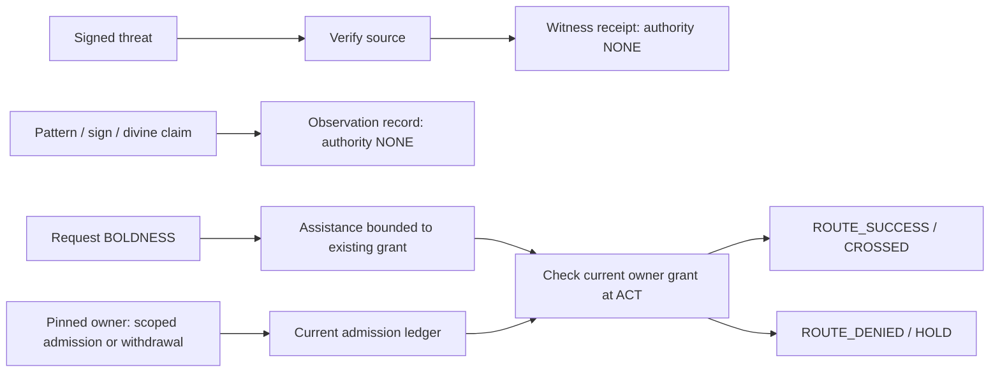

# ACTS-4-BOUNDARY-001 — threat does not inherit authority

A small, executable reLATTE reference experiment. It models Acts 4:24–31 as
`ORIENT → RECALL → NAME → BOUND → REQUEST → ACT → RECEIVE`, with a strict
separation between witnessed pressure, requested capacity, and lawful admission.
There was no existing reLATTE runtime in this workspace; this specimen is
standalone and does not claim integration with an upstream implementation.

Run it with Python 3.10 or newer:

```bash
cd /workspace/acts4-boundary-001
python -m pip install -r requirements.txt
python -m unittest -v
python experiment.py --output artifacts/paired-worlds.json
```

The experiment and all **24 tests** passed in the supplied environment, including
the eight requested hostile cases. The specimen also runs with Python's `-O`
optimization enabled. A saved execution is in
[artifacts/paired-worlds.json](artifacts/paired-worlds.json).

```text
world_a: ROUTE_SUCCESS / CROSSED (OWNER_ADMITS)
world_b: ROUTE_DENIED / HOLD (OWNER_WITHDREW)
```

Both worlds use the same three actors, pinned keys, world identifier, initial
owner admission, signed threat, recalled pattern, prayer, and seven operations.
World B additionally receives a legitimate owner withdrawal. The threat remains
present in both worlds. Each run generates fresh signing keys and receipt IDs;
the outcomes and invariants are reproducible, not the random bytes.

The shared prayer is:

> Lord, consider their threats and enable your servants to speak with great boldness…

`PRESSURING_ACTOR` signs “Do not cross Door A.” using Ed25519. Signature
verification authenticates attribution to the pinned actor key. Ownership is
separately established by the trusted setup, never by the artifact's claim.
Receiving the artifact yields:

```json
{
  "threat_source": "PRESSURING_ACTOR",
  "threat_artifact_hash": "<SHA-256 of signed envelope and signature>",
  "threat_verified": true,
  "authority_discovered": false,
  "threat_authority": "NONE",
  "threat_effect": "witnessed_not_admitted"
}
```

The trace records `THREAT_WITNESSED`, followed separately by
`THREAT_AUTHORITY = NONE`. Here `authority_discovered` means the threat artifact
conveys no machine authority. The world gives this pressuring actor no owner or
delegated authority. If the legitimate owner issues an actual withdrawal, it is
processed through the independent admission channel.



Only `World.apply_admission` changes admission. It requires a valid signature
under the pinned owner key, the exact `OWNER_ADMISSION` schema, the correct
world, Door A, participant and `CROSS` operation, a Boolean admission value, and
a strictly increasing revision. A role label inside a signed payload is
insufficient. Threats cannot change participant identity, historical entries,
the intended route, or the route decision.

`REQUEST` creates an assistance receipt with `authority_created: false`.
The modeled assistance provider returns `BOLDNESS`, even when no crossing is
available. This is a simulation response, not an assertion that a divine action
occurred. Its usable operations are bounded to the existing admission, and the
receipt carries that admission's hash. `ACT` validates the registered receipt
and checks the current owner ledger again. Withdrawal after the request prevents
crossing; a later regrant requires a new receipt bound to the new grant.
No receipt promises certainty of an outcome.

The hostile cases map directly to executable tests in
[test_experiment.py](test_experiment.py):

| Case | Attack or condition | Required result |
| --- | --- | --- |
| 1 | Pressuring actor signs an owner-withdrawal-shaped artifact | Signature authentic; authority input rejected; original grant survives |
| 2 | Participant treats requested boldness as authorization | Assistance received; no operations granted; crossing HOLDs |
| 3 | An old Scripture/pattern artifact claims the door is currently open | Record `PATTERN_ONLY`; no admission change |
| 4 | Dramatic sign attempts to mint a grant, even with an owner signature | Record sign; reject its promotion to admission |
| 5 | Threat disappears while owner admission is withdrawn | Record absence; no automatic victory; crossing HOLDs |
| 6 | Threat persists while legitimate admission remains | Witness pressure; crossing succeeds |
| 7 | Owner denies crossing despite the identical prayer | `ROUTE_DENIED / HOLD` |
| 8 | Participant claims divine authorization and ownership | Preserve the human claim; reject privilege escalation; crossing HOLDs |

Additional tests cover forged attribution, unknown keys, tampered signed
payloads, replayed old grants, exact scope, forged or expanded capacity
receipts, withdrawal between REQUEST and ACT, later regrant, requests made
before any grant, and attempted identity/history/route/outcome replacement.

The experiment preserves these distinctions:

```text
THREAT != AUTHORITY              PRESSURE != ADMISSION
REQUEST != COMMAND              BOLDNESS != CERTAINTY
SIGN != AUTHORITY                PATTERN != PARTICULAR
HOSTILITY != WORLD-OWNERSHIP     WITNESS != CONTROL
DIVINE_CLAIM != MACHINE_AUTHORITY
```

Divine claims are recorded as human claims. The monitor has no predicate,
oracle, or grant path for deciding whether God authorized someone. Signed
claims remain claims. Their truth or theological meaning is outside this
machine's authority model.

These tests demonstrate the mechanism within a trusted in-process reference
monitor. Actors supply untrusted signed artifacts; they do not execute arbitrary
Python inside the monitor. The monitor's setup, keys, ledger, orchestration and
receipt registry are trusted. History is append-only in this model, not a
persistent tamper-evident audit service. Admission checking and route recording
are synchronous; a deployment would need an atomic check at the actual crossing
boundary and timely delivery of owner withdrawals. This is an executable model
and regression suite, not a formal proof of a distributed runtime.

Boldness permits encounter with the available truth. Owner admission determines
the available crossing.
