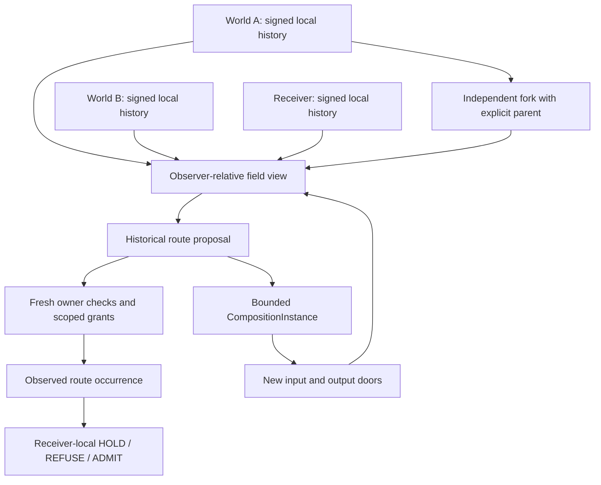

# DYNAMIC-INTERFACE-FIELD-001

A non-normative experiment extending [INTERFACE-SUPERSPACE-001](../interface-superspace-001/README.md): independently owned doors appear, disappear, fork and reconstitute; a local observer derives candidate routes from selected histories; execution checks each owner again.

The normative reLATTE core remains frozen at `f5cb7488bebc1a6e27fd458ad40af9b9b6f9e858`. This experiment changes neither the superspace planner nor its descriptors, bindings, receiver policy, crossing grammar or receipt grammar. Experimental lifecycle evidence wraps existing route receipts.



The executable sequence is:

1. The source and receiver doors exist, but no carrier route is available.
2. World A publishes X, an existing filesystem boundary and its relations. A route is synthesized, separately granted and executed.
3. A withdraws X. Its proposal remains verifiable history. Executing it against the stale view fails before traversing a relation.
4. World B publishes Y, the existing MIDI encoder, ordered event stream, observer and reconstruction boundaries. A new proposal executes through those doors.
5. A bounded composition selects the MIDI observation route as its member. Its own world publishes new input and output particulars and a new relation. A synthesized outer route enters the new door, executes the separately granted member route, returns a new particular and crosses to the receiver.
6. The composition retires its doors after its one-call allowance. Its historical proposal fails fresh owner checks.
7. A reconstitutes X with the same descriptor and interface ID but a new offer identity and explicit parent. The old plan fails; a new proposal with fresh grants executes.
8. B forks its event-emitter door into a new world and interface particular. The child inherits no grants or observer trust. After explicit local trust selection and child-issued grants, a route through the fork executes.

The proof produces five successful outer routes, three stale denials, one nested occurrence and 29 signed owner tickets. Every successful crossing receives unchanged receiver-local `R3_HOLD`.

## Local histories and views

`LocalWorld` owns an Ed25519 key and an append-only, hash-linked event sequence. Its key identifies the publishing world independently of descriptive participant names. Events include publication, withdrawal, relation publication/withdrawal, grant/revoke, composition creation and fork lineage. Descriptors remain `InterfaceParticularV0` and `InterfaceRelationV0` from the existing experiment.

An offer is an incarnation, identified by a fresh `offer_id`, descriptor digest, owner, signed publication event and expiry. Reconstituting the same interface ID never revives a previous offer or token. Relations reference both endpoint offer identities as well as their interface IDs. A relation referencing a withdrawn or superseded endpoint is excluded from the projected graph.

`FieldObserver` receives explicitly selected histories and trust anchors. It rejects signature failures, broken chains, rollback, equivocation, future events, duplicate owners, identity collisions, fabricated lineage and unattested boundary behavior. Accepted implementation attestations are local execution knowledge, separate from live advertisements and permission. An invalid projection cannot advance the observer's accepted frontier.

There is **no global registry**. Each view is an ephemeral graph projected from the histories supplied to that observer. An omitted world is outside that view; `NO_ROUTE` means no candidate in the selected view under the request constraints. A missing source gets an attributable `source_not_in_selected_view` result. The original generic planner still derives paths entirely from declared properties and relations. Opaque interface renaming preserves route structure.

Snapshots preserve selected frontiers, observation time, offer references, excluded relations and graph digest. Proposals preserve those references and the existing planner's sealed candidate. Changing an unrelated door does not invalidate a proposal whose referenced incarnations remain open.

## Owner gates and occurrence evidence

Advertisement, selection, authorization, execution and receiver admission remain separate actions. `authorize` is a specimen helper invoking explicitly held owner handles; discovery and composition construction never invoke it. The owner-control API is outside the published door. Publishing a capability does not expose a grant-issuing capability through that door.

Each independently signed grant binds issuer, interface, offer, descriptor digest, caller subject, exact operation, permission class, expiry and use allowance. An operation such as `configure` is distinct from its required `mutate` permission. A grant cannot exceed the door's authority ceiling. Revocation, lease expiry, use exhaustion, wrong subject, wrong operation and wrong incarnation each block execution.

Execution checks the availability of all referenced owners, doors and relations before starting. It then checks the relevant owner again immediately before every native operation, consumes that operation's grant and obtains a signed ticket referencing the issuer's history head. Retained signatures and old advertisements cannot substitute for a live owner decision.

Observed occurrences have fresh identities separate from proposals. They retain actual superspace relation receipts, native particular references, signed owner tickets, failures, residuals and nested occurrences. A withdrawal between steps leaves the verified prefix and denies the next operation. A withdrawal during an already admitted operation is recorded as a residual: it cannot retroactively erase the occurrence. Receiver-local admission remains in the existing crossing binding.

## Bounded composition

The founding `CompositionInstance` supports a selected, lossless observation route with no network, mutation, authorization, arbitrary shell or recursive composition. Its ceilings are eight calls, 4,096 bytes, eight member relations and a 60-second lease; the proof uses one call. Its frozen member request fixes the accepted input length. Different bytes of that length may be observed; widening the request requires a new instance.

The composition publishes actual new interface IDs, participant identity, protocol, relational retained state, capacity and evidence contract. These are independently gated doors, not aliases for a member. Its output retains ancestry from the outer input and references the separate member source and occurrence. The offline verifier checks their content digests and lineage links.

Member authority must be installed separately using member-owner grants. Outer grants cannot be used inside the member route. Every invocation repeats the member owners' freshness checks. Failure preserves nested evidence. The composition retires both doors and its internal relation during outer execution cleanup when its call allowance is exhausted; expiry and explicit retirement also close them. Construction alone creates no member grants.

## Run and verify

From the repository root, with Node 24 or later:

```sh
npm ci
node --test experiments/dynamic-interface-field-001/tests/*.test.mjs
node experiments/dynamic-interface-field-001/run.mjs
node experiments/dynamic-interface-field-001/verify-run.mjs work/dynamic-interface-field-001/proofs.json
```

The verifier reconstructs each historical view from signed prefixes of the final owner histories, verifies every proposal and observed route, checks owner tickets against the grant and door state at their signed history heads, checks nested composition ancestry, verifies core crossing/receipt signatures and enforces the frozen-core diff gate. Evidence is JSON and survives an independent process; it includes the founding trust anchors so the checker establishes internal consistency. A caller evaluating external evidence must select its own trusted anchors.

The 33 hostile tests also cover absent permission, grant revocation/expiry/reuse, authority escalation, stale relations, missing publishers, same-ID reconstitution, forks without inherited trust or authority, incomplete views, name erasure, malformed publication, conflicting histories, clock regression, in-flight withdrawal, mutated views, receipt substitution, composition member withdrawal, immutable budgets and request-capacity widening. CI runs these, the 35 inherited superspace tests and the full existing repository verification, then uploads the independently checked lifecycle evidence.

## Claim boundary

This is a local executable specimen with independently keyed owners, selected signed histories and direct owner handles. It adds no gossip transport, authenticated remote owner-control API, durable owner restart protocol, globally synchronized clock, distributed atomic transaction or physical causal model. A process restart creates a new world identity; it cannot reload old grant counters under an old key through this API. Histories are bounded to 4,096 events and leases to 60 seconds. Clock regression fails closed. The observer's seen frontier is process-local.

Freshness is enforced at each owner admission boundary. Previously admitted work may finish after withdrawal; subsequent steps must obtain their own admission. Unsuccessful attempts can consume grants and leave native effects, and the receipts preserve those prefixes and residuals. Signatures attribute claims; they do not establish independent physical truth.

The earned claim: a changing, history-bearing field of independently owned interface particulars can support noun-independent route proposals, incarnation-specific execution admission and bounded compositions that publish new doors, without a global registry or an enlarged normative reLATTE core.
